# Silverblue Cloud OS

This image is currently based on `ublue-os/silverblue-main:39`.

There are two images, `cloud-os-main` and `cloud-os-dotnet`.
The `dotnet` image includes everything from the main image and below packages:
 - `dotnet-sdk-6.0`
 - `dotnet-sdk-7.0`
 - `dotnet-sdk-8.0`.

# Table of contents
- [Installation](#installation)
- [GUI Tools](#gui-tools)
- [CLI Tools](#cli-tools)
- [Tips](#tips)
  - [Neovim](#neovim)
  - [Flameshot](#flameshot)
  - [Oh my zsh](#oh-my-zsh)
  - [eza](#eza)
  - [bat](#bat)
  - [starship](#starship)
  - [Alacritty](#alacritty)
  - [lazygit](#lazygit)
  - [zellij](#zellij)
- [Screenshots](#screenshots)

## Installation

To rebase an existing atomic Fedora installation to the latest build:

- First rebase to the unsigned image, to get the proper signing keys and
  policies installed.
  ```
  rpm-ostree rebase ostree-unverified-registry:ghcr.io/kerwood/cloud-os-main:latest
  ```
- Reboot to complete the rebase.
  ```
  systemctl reboot
  ```
- Then rebase to the signed image.
  ```
  rpm-ostree rebase ostree-image-signed:docker://ghcr.io/kerwood/cloud-os-main:latest
  ```
- Reboot again to complete the installation.
  ```
  systemctl reboot
  ```

The `latest` tag will automatically point to the latest build. That build will
still always use the Fedora version specified in `main.yml`, so you won't get
accidentally updated to the next major version.

## GUI Tools

  - **Alacritty** - *A fast, cross-platform, OpenGL terminal emulator.*
    - https://github.com/alacritty/alacritty
  - **AppImageLauncher** - *Integrate AppImages into your application launcher with one click*
    - https://github.com/TheAssassin/AppImageLauncher
  - **Flameshot** - *Powerful, yet simple to use open-source screenshot software.*
    - https://flameshot.org
  - **JetBrains Toolbox** - *Manage your JetBrains IDEs the easy way.*
    - https://www.jetbrains.com/toolbox-app :: [screenshot](#jetbrains-toolbox)
  - **Ulauncher** - *Application launcher for Linux.*
    - https://ulauncher.io :: [screenshot](#ulauncher-1)
  - **Visual Studio Code** - *Code editor.*
    - https://code.visualstudio.com
  - **Wireshark** - *Free and open-source packet analyzer.*
    - https://www.wireshark.org
  - **Papirus Icon Theme** - *Free and open source SVG icon theme for Linux*
    - https://github.com/PapirusDevelopmentTeam/papirus-icon-theme
  - **Ptyxis** - *Ptyxis is a terminal for GNOME with first-class support for containers.*
    - https://gitlab.gnome.org/chergert/ptyxis

## CLI Tools
  - **argocd-cli** - *CLI Tool for managing ArgoCD.*
    - https://argo-cd.readthedocs.io/en/stable/cli_installation
  - **azure-cli** - *Azure Cloud commandline tool.*
    - https://learn.microsoft.com/en-us/cli/azure
  - **bat** - *Modern cat replacement.*
    - https://github.com/sharkdp/bat :: [screenshot](#bat-1)
  - **btop** - *Resource monitor.*
    - https://github.com/aristocratos/btop :: [screenshot](#btop)
  - **distrobox** - *Use any Linux distribution inside your terminal.*
    - https://distrobox.it
  - **dive** - *A tool for exploring a docker image and its layer contents.*
    - https://github.com/wagoodman/dive :: [screenshot](#dive)
  - **docker** - *Container runtime.*
    - https://www.docker.com
  - **duf** - *Disk Usage/Free Utility.*
    - https://github.com/muesli/duf :: [screenshot](#duf)
  - **eza** - *Modern ls replacement.*
    - https://github.com/eza-community/eza :: [screenshot](#eza-1)
  - **fzf** - *General-purpose command-line fuzzy finder.*
    - https://github.com/junegunn/fzf :: [screenshot](#fzf)
  - **git** - *Version control system.*
    - https://git-scm.com
  - **google-cloud-cli** - *Google Cloud commandline tool.*
    - https://cloud.google.com/sdk/gcloud
  - **gum** - *A tool for glamorous shell scripts.*
    - https://github.com/charmbracelet/gum :: [screenshot](#gum)
  - **helm** - *Manage, template or install Helm packages.*
    - https://github.com/helm/helm
  - **httpie** - *Modern curl replacement.*
    - https://httpie.io/cli :: [screenshot](#httpie)
  - **just** - *Command runner with improvements over "make".*
    - https://github.com/casey/just :: [screenshot](#just)
  - **jq** - *Slice, filter, map and transform JSON data with ease.*
    - https://jqlang.github.io/jq
  - **k9s** - *Terminal UI to interact with your Kubernetes clusters.*
    - https://github.com/derailed/K9s :: [screenshot](#k9s)
  - **kind** - *A tool for running local Kubernetes clusters using Docker container “nodes”.*
    - https://github.com/kubernetes-sigs/kind :: [screenshot](#kind)
  - **krew** - *Plugin manager for the kubectl command-line tool.*
    - https://github.com/kubernetes-sigs/krew
  - **kubectl** - *Tool for communicating with Kubernetes control plane*
    - https://kubernetes.io/docs/reference/kubectl
  - **kubectx/kubens** - *Switch between Kubenetes contexts or namespaces with ease.*
    - https://github.com/ahmetb/kubectx :: [screenshot](#kubectxkubens)
  - **lazydocker** - *A simple terminal UI for both docker and docker-compose*
    - https://github.com/jesseduffield/lazydocker :: [screenshot](#lazydocker)
  - **lazygit** - *A simple terminal UI for git commands.*
    - https://github.com/jesseduffield/lazygit :: [screenshot](#lazygit-1)
  - **mirrord** - *Run local processes in the context of their Kubernetes environment.*
    - https://github.com/metalbear-co/mirrord
  - **mkcert** - *Simple tool for making locally-trusted development certificates.*
    - https://github.com/FiloSottile/mkcert
  - **neovim** - *Terminal based code editor.*
    - https://neovim.io
  - **ncdu** - *Review files and the disk space being used on Linux systems.*
  - **paping** - *TCP port testing, emulating the functionality of ping (port ping)*
    - https://code.google.com/archive/p/paping/
  - **ripgrep** - *Alternative grep replacement.*
    - https://github.com/BurntSushi/ripgrep :: [screenshot](#ripgrep-rg)
  - **ShellCheck** - *A static analysis tool for shell scripts.*
    - https://www.shellcheck.net/
  - **sshs** - *Terminal user interface for SSH which uses `~/.ssh/config` to list and connect to hosts.*
    - https://github.com/quantumsheep/sshs :: [screenshot](#sshs)
  - **sslscan** - *Queries SSL services in order to determine the ciphers that are supported.*
    - https://github.com/rbsec/sslscan
  - **starship** - *The minimal, blazing-fast, and infinitely customizable prompt for any shell.*
    - https://github.com/starship/starship :: [screenshot](#starship-1)
  - **stern** - *Tail multiple pods on Kubernetes and multiple containers within the pod.*
    - https://github.com/stern/stern
  - **stow** - *Symlink farm manager.*
    - https://www.gnu.org/software/stow/manual/stow.html
  - **syft** - *Generate Software Bill of Materials (SBOM) from container images and filesystems.*
    - https://github.com/anchore/syft :: [screenshot](#syft)
  - **tailscale** - *Zero config VPN for building secure networks.*
    - https://tailscale.com/
  - **trivy** - *Comprehensive and versatile security scanner.*
    - https://github.com/aquasecurity/trivy
  - **zellij** - *Modern terminal multiplexer (like tmux).*
    - https://github.com/zellij-org/zellij :: [screenshot](#zellij-1)
  - **zoxide** - *Smarter cd command, inspired by z and autojump.*
    - https://github.com/ajeetdsouza/zoxide :: [screenshot](#zoxide)
  - **zsh** - *A superior shell for your terminal needs. Unlock super powers by setting up Oh-my-zsh.*

## Tips

### Neovim
This image comes with barebone `neovim`. To unlock it's full potential install NVChad. It is very easy to install, stable and comes prepacked with a handful of usefull plugins.

https://nvchad.com/


### Flameshot
This image comes with Flameshot installed. Setup a keybinding to activate it.
As for the time of writing, if you are using Wayland (default) you will probably have some dbus permission issues as described [here](https://github.com/flameshot-org/flameshot/issues/3326),
a workaround is to launch flameshot from a shell script which is included in the image.

tldr; If you are using Wayland, set this path in your keybinding: `/usr/flameshot/flameshot.sh`

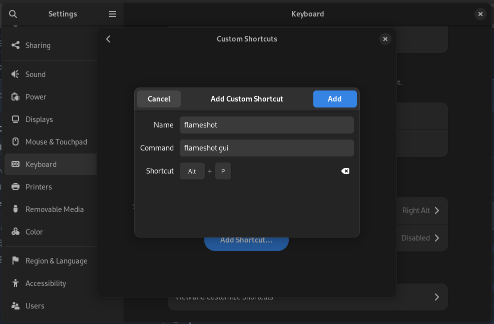

### Ulauncher
If you are using Ulauncher in Wayland you should set the keybinding manual as Ulauncher does not receive hotkey events when triggered from some windows (like terminal or OS Settings).

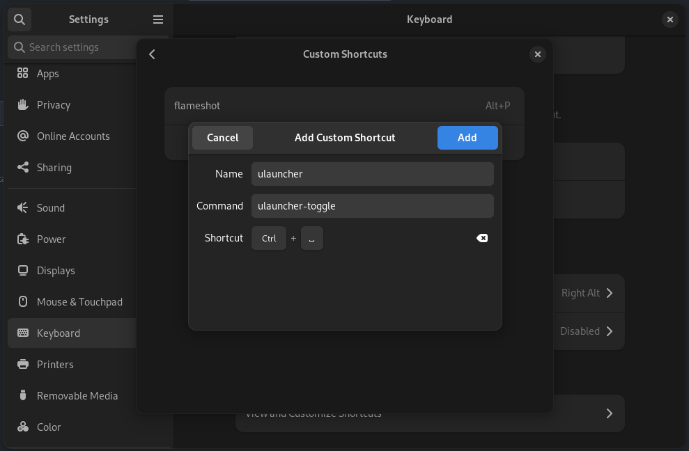

### Oh My Zsh
This images comes with the `zsh`. To unlock it's full potential setup Oh My Zsh, its very easy.

Change your default shell to `zsh`.
```
chsh -s /usr/bin/zsh <user-name>
```

Go to https://ohmyz.sh/#install and install it with one command.

### eza
`eza` is a dropin `ls` replacement. Here's a few aliases you can use to replace `ls`.
```
alias ls="eza"
alias ll="eza --icons --git --header --group-directories-first -l"
alias l="eza --icons --git --header --group-directories-first -l"
```

### bat
`bat` is a dropin replacement for `cat`. Here's an alias that replaces `cat`, but without line numbers. This way you get `cat` with syntax highlighting and git support.
```
alias cat='bat -p'
```

### starship
A base configuration for starship can be found at `/usr/dotfiles/starship.toml`.
```
cp /usr/dotfiles/starship.toml ~/.config
```

### Alacritty
A base configuration for alacritty can be found at `/usr/dotfiles/alacritty`.
```
cp -a /usr/dotfiles/alacritty ~/.config
```

### lazygit
A base configuration for lazygit can be found at `/usr/dotfiles/lazygit`.
```
cp -a /usr/dotfiles/lazygit ~/.config
```

### zellij
A base configuration for zellij can be found at `/usr/dotfiles/zellij`.
```
cp -a /usr/dotfiles/zellij ~/.config
```

## Screenshots

### Jetbrains Toolbox
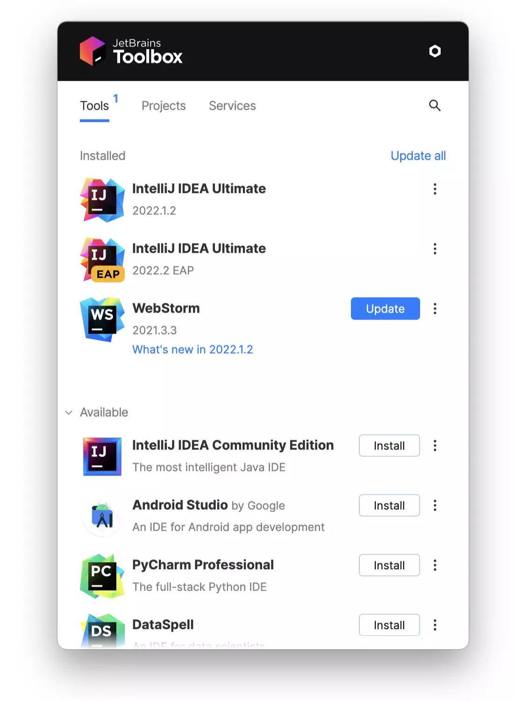

### Ulauncher
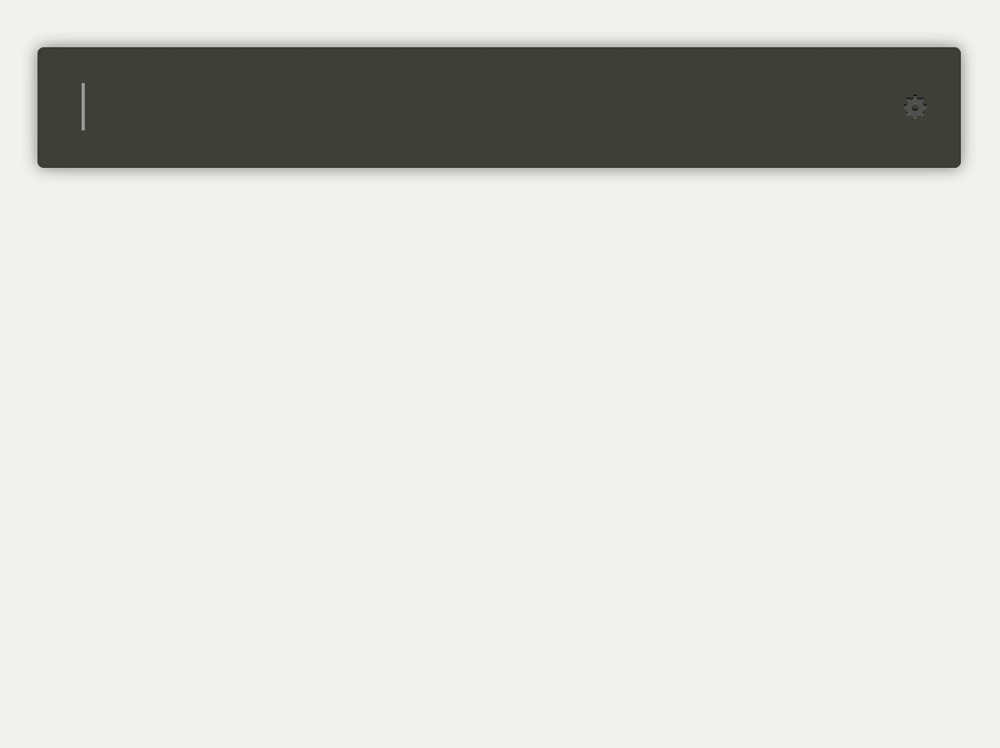

### Dive
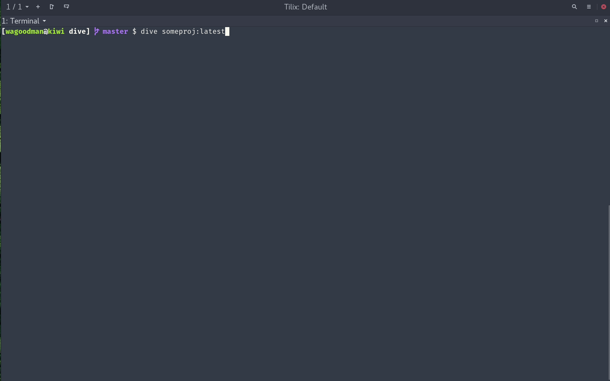

### k9s
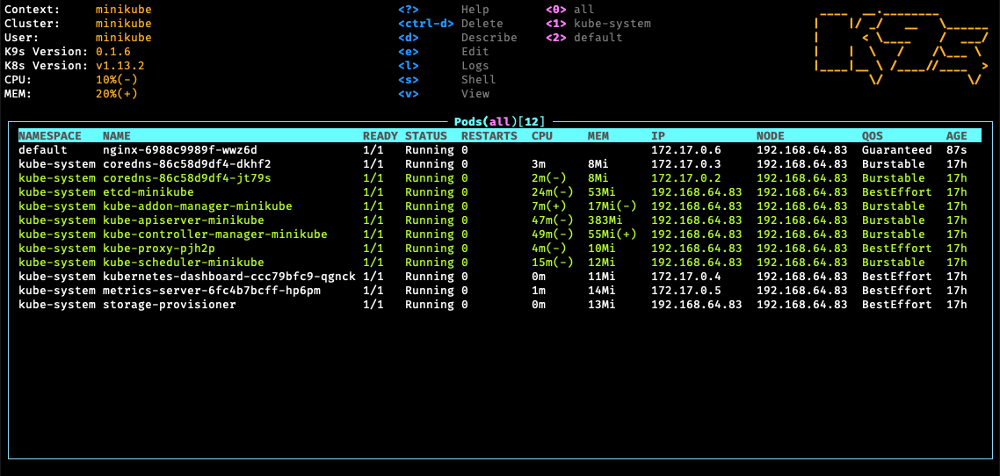

### kind
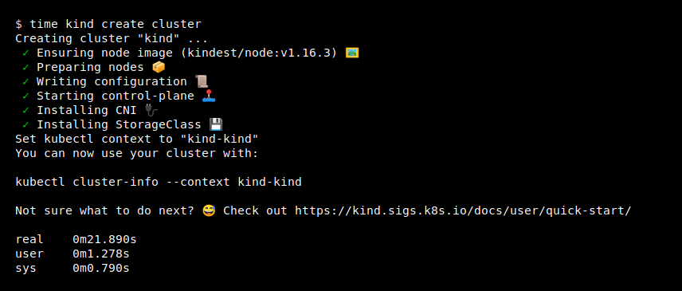

### kubectx/kubens


### lazydocker


### syft
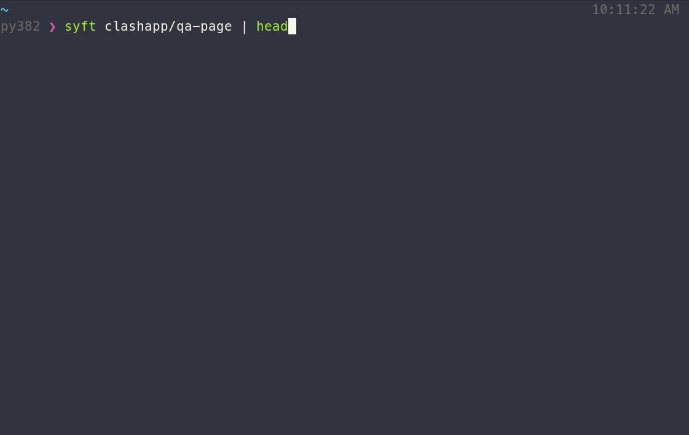

### zellij


### starship


### sshs


### gum
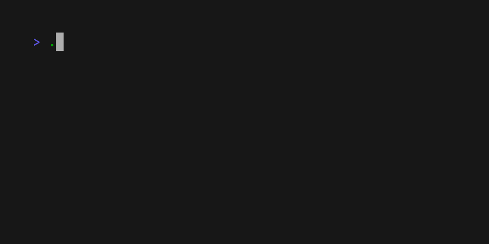

### httpie
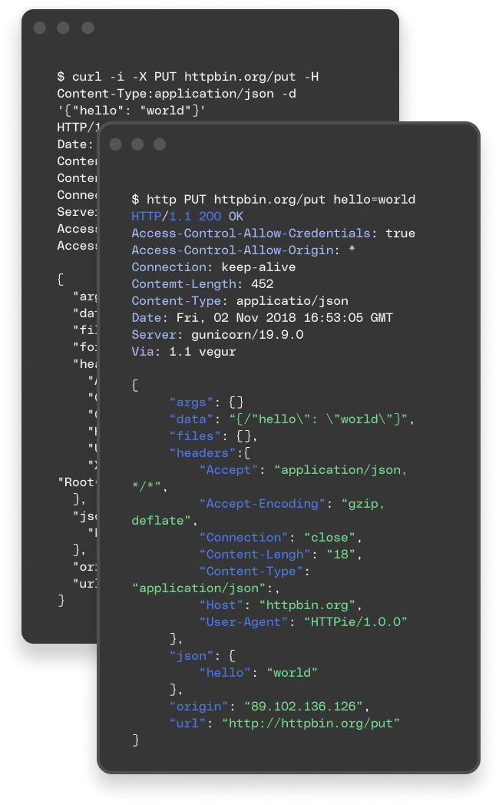

### ripgrep (rg)
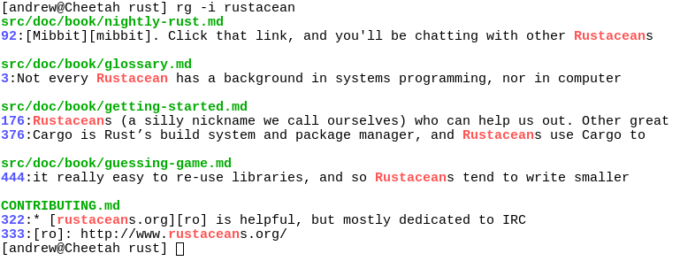

### eza


### bat


### just


### lazygit


### fzf
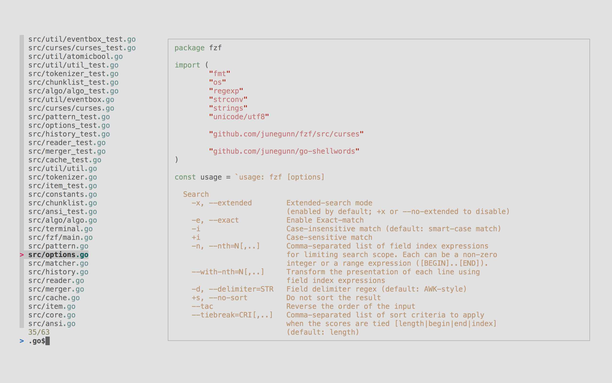

### btop


### zoxide


### duf


### ncdu
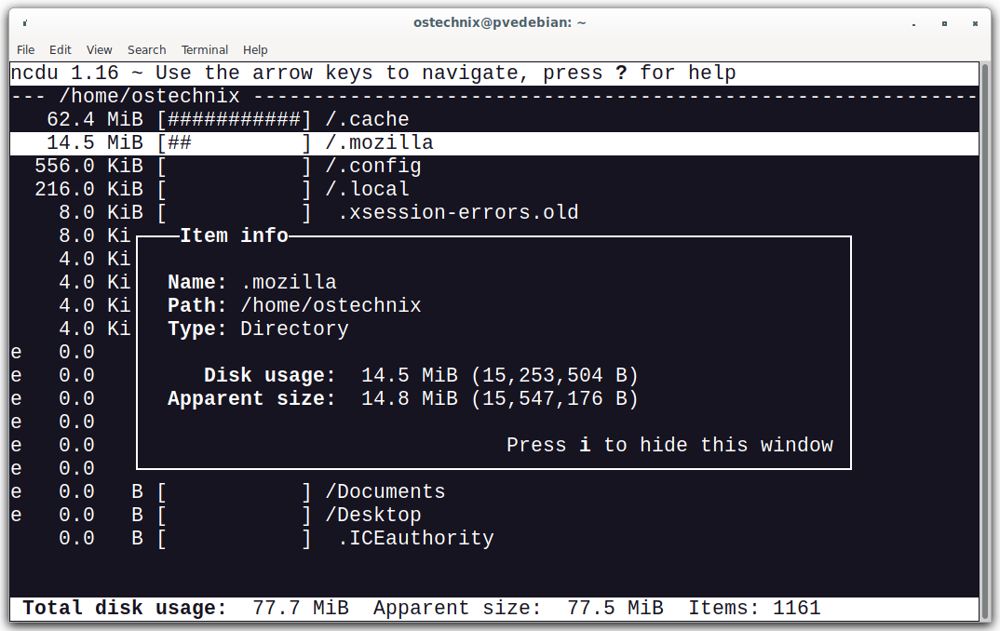
