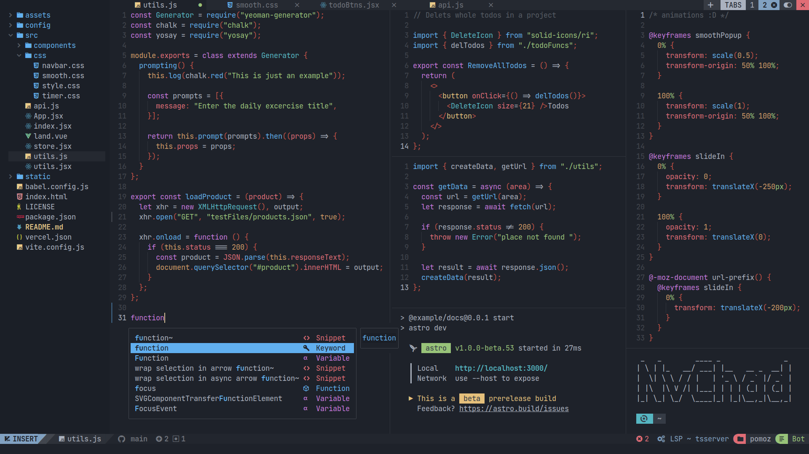

# Silverblue Cloud OS

This image is currently based on `ublue-os/silverblue-main:39`.

# Table of contents

- [Installation](#installation)
- [GUI Tools](#gui-tools)
- [CLI Tools](#cli-tools)
- [Tips](#tips)
  - [Neovim](#neovim)
  - [Flameshot](#flameshot)
  - [Oh my zsh](#oh-my-zsh)
  - [eza](#eza)
  - [bat](#bat)
  - [starship](#starship)
  - [Alacritty](#alacritty)
  - [lazygit](#lazygit)
  - [zellij](#zellij)
- [Screenshots](#screenshots)

## Installation

To rebase an existing atomic Fedora installation to the latest build:

- First rebase to the unsigned image, to get the proper signing keys and
  policies installed.
  ```
  rpm-ostree rebase ostree-unverified-registry:ghcr.io/kerwood/cloud-os:latest
  ```
- Reboot to complete the rebase.
  ```
  systemctl reboot
  ```
- Then rebase to the signed image.
  ```
  rpm-ostree rebase ostree-image-signed:docker://ghcr.io/kerwood/cloud-os:latest
  ```
- Reboot again to complete the installation.
  ```
  systemctl reboot
  ```

The `latest` tag will automatically point to the latest build. That build will
still always use the Fedora version specified in `recipe.yml`, so you won't get
accidentally updated to the next major version.

## GUI Tools

- **Alacritty** - _A fast, cross-platform, OpenGL terminal emulator._
  - https://github.com/alacritty/alacritty
- **AppImageLauncher** - _Integrate AppImages into your application launcher
  with one click_
  - https://github.com/TheAssassin/AppImageLauncher
- **Discord** - _An instant messaging and VoIP social platform which allows
  communication through voice calls, video calls, text messaging, and media and
  files._
  - https://discord.com/
- **Flameshot** - _Powerful, yet simple to use open-source screenshot software._
  - https://flameshot.org
- **JetBrains Toolbox** - _Manage your JetBrains IDEs the easy way._
  - https://www.jetbrains.com/toolbox-app
- **Spotify** - _A digital music service that gives you access to millions of
  songs._
  - https://spotify.com
- **Ulauncher** - _Application launcher for Linux._
  - https://ulauncher.io
- **Visual Studio Code** - _Code editor._
  - https://code.visualstudio.com
- **Wireshark** - _Free and open-source packet analyzer._
  - https://www.wireshark.org
- **Papirus Icon Theme** - _Free and open source SVG icon theme for Linux_
  - https://github.com/PapirusDevelopmentTeam/papirus-icon-theme

## CLI Tools

- **argocd-cli** - _CLI Tool for managing ArgoCD._
  - https://argo-cd.readthedocs.io/en/stable/cli_installation
- **azure-cli** - _Azure Cloud commandline tool._
  - https://learn.microsoft.com/en-us/cli/azure
- **bat** - _Modern cat replacement._
  - https://github.com/sharkdp/bat
- **bombardier** - _HTTP(S) benchmarking tool._
  - https://github.com/codesenberg/bombardier
- **btop** - _Resource monitor._
  - https://github.com/aristocratos/btop
- **caddy** - _Caddy is an extensible web server platform that uses TLS by
  default._
  - https://github.com/caddyserver/caddy
- **distrobox** - _Use any Linux distribution inside your terminal._
  - https://distrobox.it
- **dive** - _A tool for exploring a docker image and its layer contents._
  - https://github.com/wagoodman/dive
- **docker** - _Container runtime._
  - https://www.docker.com
- **duf** - _Disk Usage/Free Utility._
  - https://github.com/muesli/duf
- **eza** - _Modern ls replacement._
  - https://github.com/eza-community/eza
- **fzf** - _General-purpose command-line fuzzy finder._
  - https://github.com/junegunn/fzf
- **git** - _Version control system._
  - https://git-scm.com
- **git-delta** - _A syntax-highlighting pager for git, diff, and grep output._
  - https://github.com/dandavison/delta
- **google-cloud-cli** - _Google Cloud commandline tool._
  - https://cloud.google.com/sdk/gcloud
- **gum** - _A tool for glamorous shell scripts._
  - https://github.com/charmbracelet/gum
- **helm** - _Manage, template or install Helm packages._
  - https://github.com/helm/helm
- **httpie** - _Modern curl replacement._
  - https://httpie.io/cli
- **just** - _Command runner with improvements over "make"._
  - https://github.com/casey/just
- **jq** - _Slice, filter, map and transform JSON data with ease._
  - https://jqlang.github.io/jq
- **k9s** - _Terminal UI to interact with your Kubernetes clusters._
  - https://github.com/derailed/K9s
- **kind** - _A tool for running local Kubernetes clusters using Docker
  container “nodes”._
  - https://github.com/kubernetes-sigs/kind
- **krew** - _Plugin manager for the kubectl command-line tool._
  - https://github.com/kubernetes-sigs/krew
- **kubectl** - _Tool for communicating with Kubernetes control plane_
  - https://kubernetes.io/docs/reference/kubectl
- **kubectx/kubens** - _Switch between Kubenetes contexts or namespaces with
  ease._
  - https://github.com/ahmetb/kubectx
- **lazydocker** - _A simple terminal UI for both docker and docker-compose_
  - https://github.com/jesseduffield/lazydocker
- **lazygit** - _A simple terminal UI for git commands._
  - https://github.com/jesseduffield/lazygit
- **mirrord** - _Run local processes in the context of their Kubernetes
  environment._
  - https://github.com/metalbear-co/mirrord
- **neovim** - _Terminal based code editor._
  - https://neovim.io
- **ncdu** - _Review files and the disk space being used on Linux systems._
- **paping** - _TCP port testing, emulating the functionality of ping (port
  ping)_
  - https://code.google.com/archive/p/paping/
- **ripgrep** - _Alternative grep replacement._
  - https://github.com/BurntSushi/ripgrep
- **ShellCheck** - _A static analysis tool for shell scripts._
  - https://www.shellcheck.net/
- **sshfs** - _SSHFS allows you to mount a remote filesystem using SFTP_
  - https://linux.die.net/man/1/sshfs
- **sshs** - _Terminal user interface for SSH which uses `~/.ssh/config` to list
  and connect to hosts._
  - https://github.com/quantumsheep/sshs
- **sslscan** - _Queries SSL services in order to determine the ciphers that are
  supported._
  - https://github.com/rbsec/sslscan
- **starship** - _The minimal, blazing-fast, and infinitely customizable prompt
  for any shell._
  - https://github.com/starship/starship
- **stern** - _Tail multiple pods on Kubernetes and multiple containers within
  the pod._
  - https://github.com/stern/stern
- **stow** - _Symlink farm manager._
  - https://www.gnu.org/software/stow/manual/stow.html
- **syft** - _Generate Software Bill of Materials (SBOM) from container images
  and filesystems._
  - https://github.com/anchore/syft
- **tailscale** - _Zero config VPN for building secure networks._
  - https://tailscale.com/
- **terraform** - _Automate infrastructure on any cloud with Terraform_
  - https://www.terraform.io/
- **tlrc** - _A tldr client written in Rust_
  - https://github.com/tldr-pages/tlrc
- **trivy** - _Comprehensive and versatile security scanner._
  - https://github.com/aquasecurity/trivy
- **zellij** - _Modern terminal multiplexer (like tmux)._
  - https://github.com/zellij-org/zellij
- **zoxide** - _Smarter cd command, inspired by z and autojump._
  - https://github.com/ajeetdsouza/zoxide
- **zsh** - _A superior shell for your terminal needs. Unlock super powers by
  setting up Oh-my-zsh._

## Tips

### Neovim

This image comes with barebone `neovim`. To unlock it's full potential install
NVChad. It is very easy to install, stable and comes prepacked with a handful of
usefull plugins.

https://nvchad.com/



### Flameshot

A keybinding (`Alt` + `p`) is already preconfigured with this image, so below
information is only needed if you want to change it.

As for the time of writing, if you are using Wayland (default) you will probably
have some dbus permission issues as described
[here](https://github.com/flameshot-org/flameshot/issues/3326), a workaround is
to launch flameshot from a shell script which is included in the image.

tldr; If you are using Wayland, set this path in your keybinding:
`/usr/flameshot/flameshot.sh`


### Ulauncher

A keybinding (`Ctrl` + `space`) is already preconfigured with this image, so
below information is only needed if you want to change it. If you are using
Ulauncher in Wayland you should set the keybinding manual as Ulauncher does not
receive hotkey events when triggered from some windows (like terminal or OS
Settings).


### Oh My Zsh

This images comes with the `zsh`. To unlock it's full potential setup Oh My Zsh,
its very easy.

Change your default shell to `zsh`.

```
chsh -s /usr/bin/zsh <user-name>
```

Go to https://ohmyz.sh/#install and install it with one command.

### eza

`eza` is a dropin `ls` replacement. Here's a few aliases you can use to replace
`ls`.

```
alias ls="eza"
alias ll="eza --icons --git --header --group-directories-first -l"
alias l="eza --icons --git --header --group-directories-first -l"
```

### bat

`bat` is a dropin replacement for `cat`. Here's an alias that replaces `cat`,
but without line numbers. This way you get `cat` with syntax highlighting and
git support.

```
alias cat='bat -p'
```

### starship

A base configuration for starship can be found at `/usr/dotfiles/starship.toml`.

```
cp /usr/dotfiles/starship.toml ~/.config
```

### Alacritty

A base configuration for alacritty can be found at `/usr/dotfiles/alacritty`.

```
cp -a /usr/dotfiles/alacritty ~/.config
```

### lazygit

A base configuration for lazygit can be found at `/usr/dotfiles/lazygit`.

```
cp -a /usr/dotfiles/lazygit ~/.config
```

### zellij

A base configuration for zellij can be found at `/usr/dotfiles/zellij`.

```
cp -a /usr/dotfiles/zellij ~/.config
```
